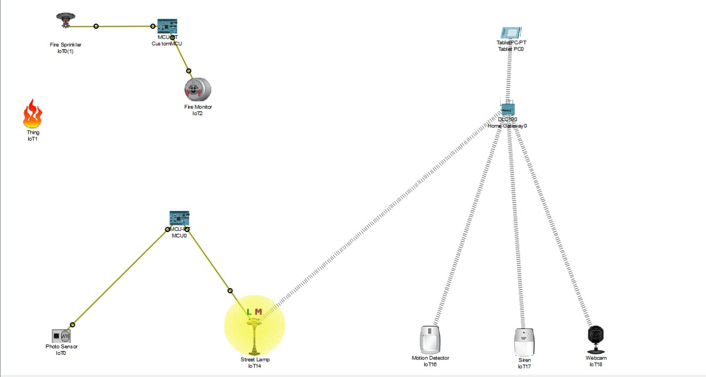

📄 Submission Statement

This project titled “Smart City IoT Simulation Project (Cisco Packet Tracer)” is submitted by Group 4 as part of the Applied Industrial Internet of Things (IIoT) coursework.

👥 Group 5 Members

Lakshay – Roll No. 2410996772, 
Manpreet– Roll No. 2410996773, 
Murlidhar Thakur – Roll No. 2410996774, 
Pallak – Roll No. 2410996775, 
Prateek - RollNo. 241099096777

We hereby declare that the work presented in this submission is original, completed collaboratively by Group 4, and prepared in accordance with the guidelines provided.

# Smart City IoT Simulation Project (Cisco Packet Tracer)

This repository contains an IoT-based Smart City simulation built using Cisco Packet Tracer. 
The project demonstrates how IoT devices and automation can be used to improve safety, efficiency, 
and monitoring in modern urban environments.

---

## 🚀 Project Features

### ✅ Smart Surveillance System
- Smart cameras installed across the city
- Motion-based alert system
- Camera monitoring via IoT server

### ✅ Intelligent Street Lighting
- Streetlights controlled by motion and light sensors
- Automatic ON/OFF behavior
- Energy-efficient smart lighting simulation

### ✅ Fire Detection System
- Smoke and temperature sensors inside buildings
- Instant alerts sent to IoT server
- Alarm activation logic

### ✅ Centralized IoT Server
- Device registration and management
- Real-time data monitoring
- Automated responses based on sensor input

---

